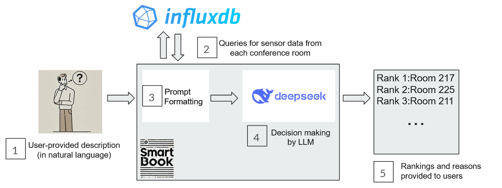
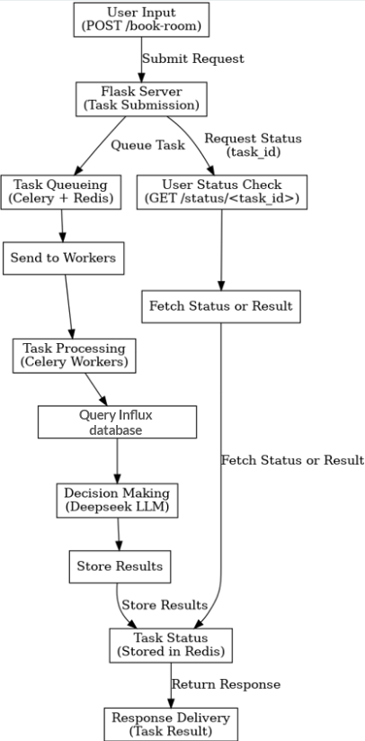

# SmartBook: Adaptive Room Recommendation System

SmartBook is an intelligent room recommendation system that leverages natural language descriptions and real-time sensor data to provide users with ranked conference room suggestions.

## Overview

The SmartBook system integrates the following key components:
1. **User Input**: Users describe their requirements in natural language.
2. **Sensor Data**: Retrieves real-time data from conference room sensors via InfluxDB.
3. **Prompt Formatting**: Formats user inputs and sensor data for processing.
4. **LLM Decision Making**: Uses the DeepSeek LLM to rank and recommend conference rooms.
5. **Ranked Results**: Outputs ranked conference room suggestions with reasons.



## Features

- **Natural Language Processing**: Understands user-provided descriptions for room preferences.
- **Real-Time Insights**: Queries sensor data to evaluate room conditions dynamically.
- **AI-Powered Decision Making**: Leverages advanced LLM for ranking decisions.
- **Transparent Recommendations**: Provides reasons for the ranking of each room.

## Installation and Setup

### Prerequisites

Ensure you have the following installed:
- Python 3.9+
- Redis server
- Celery
- InfluxDB

### Backend Server Instructions

1. Start the Redis server:
   ```bash
   sudo service redis-server start
   ```

2. Run the Celery worker:
   ```bash
   celery -A test_1.tasks worker --loglevel INFO
   ```

3. Start the backend server:
   ```bash
   python -m test_1.app
   ```

4. Run the test suite:
   ```bash
   pytest -s test_1/pytest.py
   ```

### Jupyter Notebook Demo

For a step-by-step demonstration, explore the Jupyter Notebook located in the `step-by-step-nb` folder.

```bash
cd step-by-step-nb
jupyter notebook
```

## Backend Architecture




## Contribution

Contributions are welcome! Please fork the repository and submit a pull request.

## License

This project is licensed under the [MIT License](./LICENSE).

---
